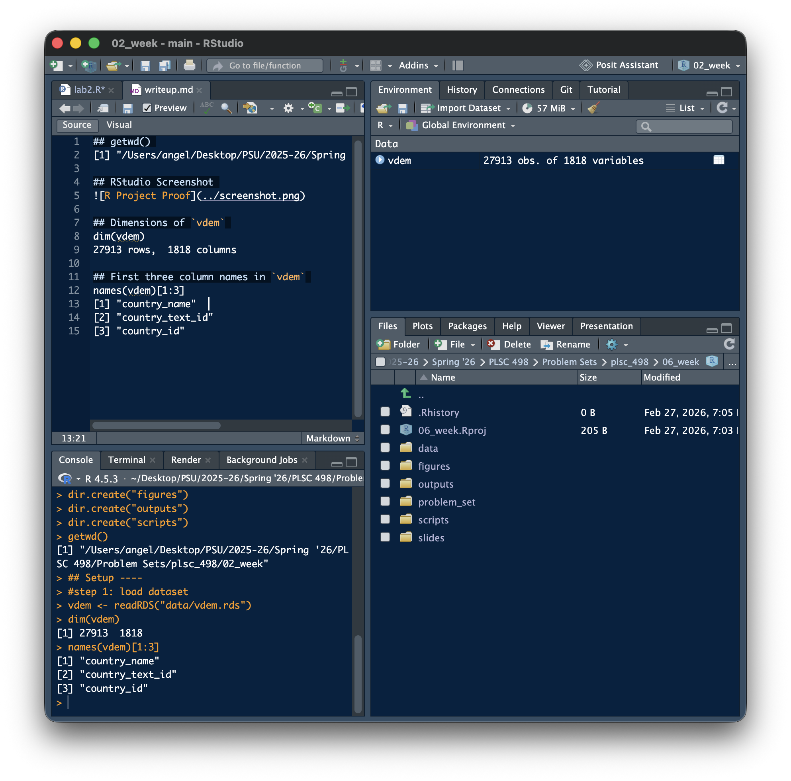

## getwd()

[1] "/Users/angel/Desktop/PSU/2025-26/Spring '26/PLSC 498/Problem Sets/plsc_498/02_week"

## RStudio Screenshot

## Dimensions of `vdem`

dim(vdem) 27913 rows, 1818 columns

## First three column names in `vdem`

names(vdem)[1:3]

[1] "country_name"\
[2] "country_text_id"\
[3] "country_id"

## Variable Proofs

### var_proof_check \<- c("v2clacjstw","v2clacjstm","v2clkill","v2cltort")

### var_proof_check %in% names(vdem)

[1] TRUE TRUE TRUE TRUE

### str(vdem[, var_proof_check])

All variables of interest are number classes.

## Interpretation

- The baseline plot allows for a general (positive) trend to be seen in the data

- Extension 1 makes it easier to see whether men or women have more freedom from torture using size encoding

- Extension 2 adds a lot of information to the visualization, and while adding information about whether men or women escape political killings more frequently, it gets lost within the busyness of the data
