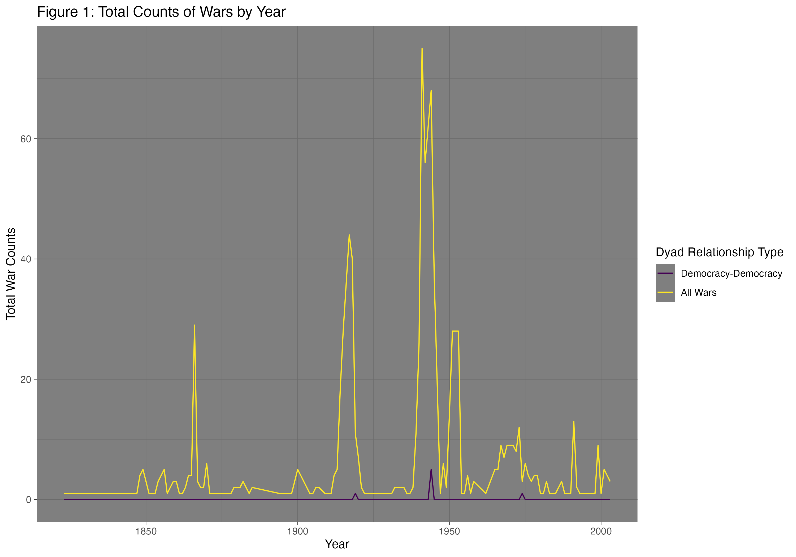
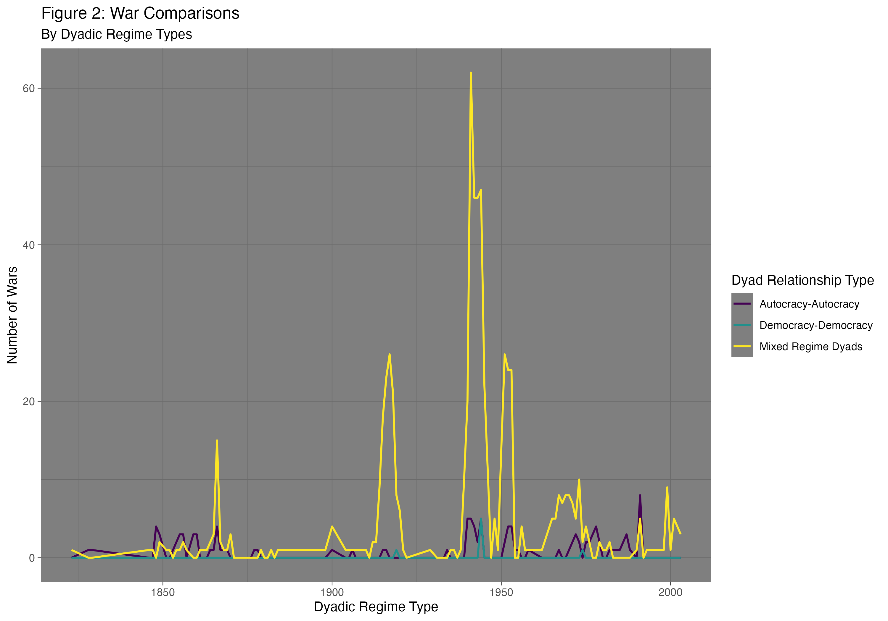
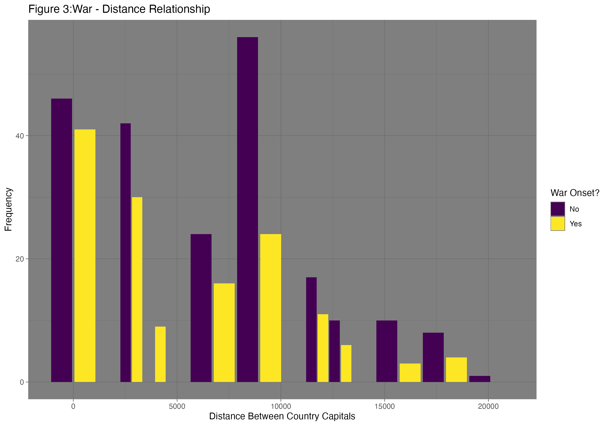
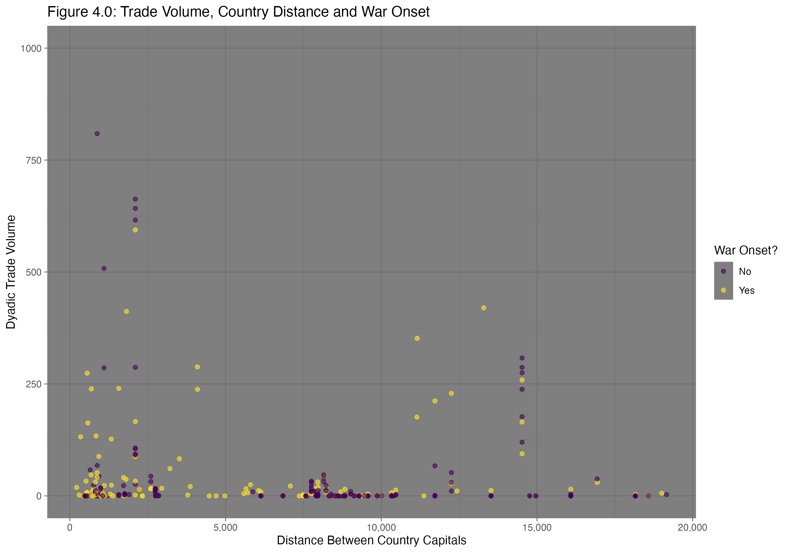
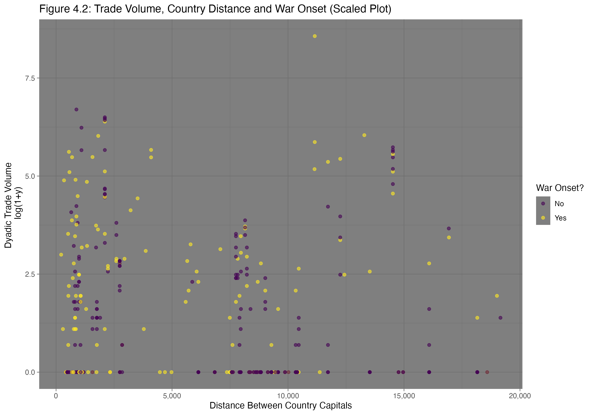

## Data construction decisions

The year-level dataset `df_yl` is constructed by the aggregation of the dyadic-year dataset provided by the Correlates of War (COW) main dataset. It groups each unit by year, so that each data point is representative of details for the entire year listed. The unit of analysis here is strictly wars per year, with total wars, as well as total wars between democracies being highlighted. After grouping the dataset `df_yl` by years, counts of the total amounts of wars each year are conducted by counting the instances where two countries are in ongoing conflict (`cowinterongoing == 1`). Likewise, the dataset counts the number of instances that satisfy the requirement of two opposing states both having a democratic, autocratic, or anocratic regime type (using `polity21` and `polity22`). In addition to this, using the same aggregation method, every combination of regime conflicts is counted for as well, offering a subsetted view of the wars during their respective years.

## Justifying [Figure 1](../figures/warsbyyears.png): Total Counts of Wars by Year

This visualization uses a smooth line to display the number of wars per year utilizing counts. The use of a normal line-plot is to give viewers a clear idea of what trends occur over time, where there are any spikes in war activity or any dips. I opted for a count-based visualization due to the desired outcome - I want to show raw data counts for accuracy and transparency. Showing rates, in my opinion, leaves room for misinterpretation, whereas counts are strictly keeping a tally of the number of occurrences. The background color was picked so that the colorblind accessible color palette would contrast well enough for most viewers to engage with the visualization.

## Justifying [Figure 2](../figures/warcompregimes.png): War Comparisons by Dyadic Regime Types

Figure 2 breaks down into detail the information portrayed in Figure 1, utilizes a similar line-plot to compare three regime dyads (Democracy-Democracy, Autocracy-Autocracy, and every mixed combination of regimes at war). The decision to allow for overlapping is to allow for clear comparisons to be made, as faceting these into three separate plots runs the risk of over- or under- representing the magnitude of war occurrences for each regime dyad type. In regards to color, the pallette is utilized to differentiate regime type from each other. That is, the dyadic relationships listed above are encoded using a colorblind friendly color-palette as well for accessibility across all viewers, the the same contrasting background as Figure 1.

## Justifying [Figure 3](../figures/wardistrel.png): War-Distance Relationship

Figure 3 utilizes a side-by-side, paired histogram to show show how often wars within certain distances from each other being conflicts. Colors are, once again, colorblind friendly in an attempt to aid in accessibility, encoded to represent whether or not there was an onset of war in that year. At every binned distance, save for one bin, it is clear that war onset is less likely, as the "No" bars are always showing a higher frequency of occurrence relative to onset of war (meaning, it is more common for wars to *not* start than it is to start).

## Justifying [Figure 4.0](../figures/tradedistwar.png): Trade Volume, Country Distance and War Onset

Figure 4 features a scatter-plot showing the relationship between trade volume and distance between countries, grouping by whether there was an onset of war in that year for that specific instance of recorded war. The scatter-plot was selected as the medium for its ability to show any possible apparent trends in the data, with the categorical "War Onset?" color encoded for further trend identification. Each point is partially transparent to allow for areas of concentrated data to be interpreted as such. Again, the plot utilizes a colorblind accessible palette with contrasting dark background to aid in viewing. This plot was zoomed in, and consequently cut off a single far outlier in favor for understanding a bulk majority of the data.

## Raw vs Transformed Scales: Trade Volume, Country Distance, and War Onset ([Figure 4.1](../figures/tradedistwar_raw.png) vs [Figure 4.2](../figures/tradedistwar_scaled.png))

Figure 4.1 and Figure 4.0 are both utilizing many of the same parameters and data, with the key difference residing in the scaling. Figure 4.1 is the un-zoomed version of Figure 4.0, including the outlier that makes much of the data near impossible to interpret. Figure 4.2 addresses this issue by adding 1 to all values trade volume values, and taking the log of the resulting value (this is done to address all observations where dyadic trade volume is 0, to avoid negative infinitive values), thereby making all the data more interpretative while keeping the relative locations between each point. This make it easier to interpret general trends within the data, something the raw plot fails to allow. With this, though, comes the difficulty intuitively interpreting magnitude of trade volume. Since these values are logged, they intuitively reveal relationships and trends rather than effects of magnitude. Presented with both Figures 4.1 and 4.2, I would opt to show both a policymaker and a methods audience Figures 4.2. In regards for the policymaker, the decision is to easily explain trends in the data, without concern of outliers skewing interpretation. In regards for a methods audience, I can more reliably trust that they can interpret that the higher a logged trade volume value is, the more likely it is presented as an outlier, and can make more informed assumptions about the data, while still retaining general interpretation of trends in the data.

## Bad Visualization - [Figure 5](../figures/bad_boxplot.png): Comparing Onset of Wars by Country Distance

-   There is over-plotting using jittered-points that gives the sense that data should be scattered around across the x-axis despite their true positioning being located along the center of the box-plot, which would also offer little substantive insight.

-   The labels are misleading, with the y-axis showing distances between countries rather than distance between country capitals (an important difference, i.e., is it referencing border-to-border distance, capital-to-capital, etc.?), while the x-axis fails to explain what `cowinteronset` is measuring, making comparisons across groups difficult without intimate knowledge of the data.

-   With no color encoding, coupled with the plotted points, it is difficult to understand that the data points are respective to which box-plot they are centered around, and can instead be seen as a full scatter-plot that is showing no correlation between `factor(cowinteronset` and the Distances Between Countries.

## Interpretation & Narrative (800-1200 words)

In this analysis of the Correlates of War, I aimed to learn how wars behave on a year-to-year basis, as well as their relationships with trade volume, distances between the two states at war, and dyadic regime types. Broadly, I attempted to gain a deeper understanding of the commonality of war and their influences and effects.

Figure 1 and Figure 2 both attempt to address yearly war behaviors by plotting time series. Figure 1 shows ongoing war frequencies by year, including the number of wars in which the two states in conflict are both democracies. This time series shows the volatile nature of wars over time, as it the number of ongoing wars visualized varies greatly and sees high sudden peaks followed by sudden drop-offs. Wars in which two democracies are at conflict make up a very small portion of these volatile peaks, reaffirming the popular — and highly debated — Democratic Peace Theory. Figure 1 shows that, while war is volatile, war between two democratic states is historically rare.

The use of a time-series here limits exact value comparisons, in favor of a broader qualitative comparison between all wars and wars between democracies; however, given the circumstance that the share wars between democracies have in all wars is small, both quantitative and observationally qualitative analysis are sufficient. The dark background seen in Figure 1 (and all subsequent figures) is intentional so as to allow the colorblind-accessible palette to contrast nicely, though it risks adding visual busyness to the visualization.

Figure 2 expands further on what is learned in Figure 1 — focusing on wars between democracies, wars between autocracies, and wars where the two states have differing regime types — while remaining a time series. This visualization shows that the main contributor to the volatility of war over time are wars between differing regimes, with both wars between democracies and wars between autocracies sharing a similar and equally small in magnitude trend over time. The largest and most notable limitation here is the busyness of having three separate lines plotting time series data, with this being apparent when attempting to compare wars between democracies against wars between autocracies. While this limits clarity, it allows for easy and quickly interpretable comparative analysis between different dyadic regime types over time.

Figure 3 moves towards understanding the dyadic nature of war, analyzing the relationship between the distance of conflicting states’ capital cities and the occurrence of war. Figure 3 uses the onset of war as an indication of a new war occurrence among ongoing wars. This histogram shows that *generally* as the distance between states at war increases, the occurrence of war decreases. In addition to this relationship, it is clear that at most distances between states, the non-occurrence of new war is higher than the occurrence of a new war, highlighting the rarity of war occurrence in relation to non-occurrence.

Figure 4.0 develops a full analysis of the relationship between trade volume, war occurrence, and distance between countries. Utilizing a scatter-plot here is the most ideal medium, as it allows for any relationships to be easily identified while still allowing subgrouping via color encoding. In this figure, we can see there is a loose negative correlation between trade volume and distance, with a concentration of wars occurring between states in closer proximity of one another. The use of color encoding here makes it hard to intuitively see the relationship between trade volume and war occurrence, but in turn allows for the analysis between two continuous measures (trade volume and distance), which is more intuitive for a scatter-plot. Figure 4.0 is also limited by the concentration of data when trade volume is at or near 0, making it difficult to fully understand the relationship between trade volume and distances between conflicting states when trade volume.

Figure 4.2 addresses this issue by transforming the trade volume data. By adding 1 to all trade volume data points and logging the resulting values, the resulting visualization allows more data to be seen, while avoiding infinitely negative values and bringing into view potential outliers. There are several drawbacks with this. First, while bringing outliers into view is helpful for interpretation, it can both fail to identify any outliers, as well as undermine the perceived effect any outlier may have on trends in the data. Second, logged data is not highly intuitive for determining if there’s linearity within the plotted relationship. In the same light, it can also obscure the interpretation of the color encoded data as well. Despite these drawbacks, we can still draw general trends and relationships over distance in Figure 4.2, though they will not be quantitatively intuitive or representative of magnitude, it offers the ability to understand trends in the data. Figure 4.2 shows the same inverse relationship between trade volume and distance between states, as well as war occurrences being more common in states with smaller distances between them.

##git status 
Angels-MacBook-Pro:08_week angel$ git status
On branch main
Your branch is up to date with 'origin/main'.

nothing to commit, working tree clean

##git log -3 
Angels-MacBook-Pro:08_week angel$ git log -3
commit 066038652ccac7f7f2a68f2e15c431e2fc8949d7 (HEAD -> main, origin/main, origin/HEAD)
Author: aperez0103 <angel13per@gmail.com>
Date:   Sat Mar 7 23:27:18 2026 -0500

    midterm push

commit c831231e62ca3e729a6afa5b005bf285ae2b673c
Author: aperez0103 <angel13per@gmail.com>
Date:   Tue Mar 3 14:48:17 2026 -0500

    Update Branch

commit 87c3bb20793c95f74ea26c3efd79cd3f244c2fce
Merge: 5314ada 487bb99
Author: aperez0103 <92343392+aperez0103@users.noreply.github.com>
Date:   Fri Feb 27 19:03:37 2026 -0500

: