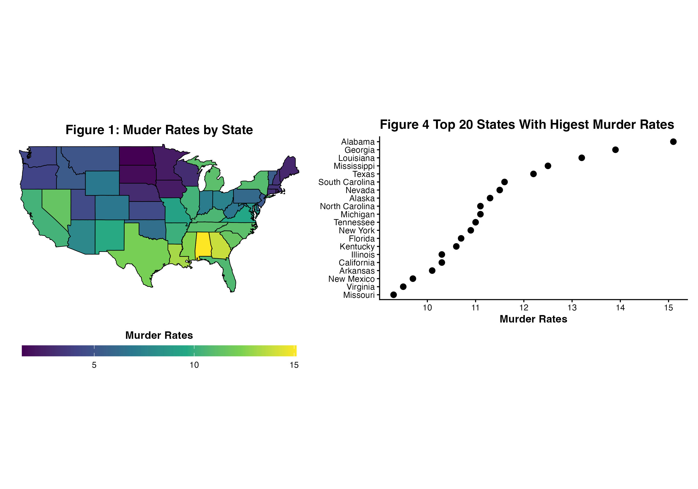

## Number of Rows

The boundary data has 15,537 rows of data, while the attribute data has 50 rows.

`> dim(us)`

`[1] 15537     6`

`> dim(state_data)`

`[1] 50  9`

## Confirmation that `region` matches across both data frames

All contiguous states are included across both data frames, with Alaska and Hawaii exluded by the boundary data. `state_data$region %in% us$region #map_data only includes contiguous USA`

[1] TRUE FALSE TRUE TRUE TRUE TRUE TRUE TRUE 
[9] TRUE TRUE FALSE TRUE TRUE TRUE TRUE TRUE 
[17] TRUE TRUE TRUE TRUE TRUE TRUE TRUE TRUE 
[25] TRUE TRUE TRUE TRUE TRUE TRUE TRUE TRUE 
[33] TRUE TRUE TRUE TRUE TRUE TRUE TRUE TRUE 
[41] TRUE TRUE TRUE TRUE TRUE TRUE TRUE TRUE 
[49] TRUE TRUE

## Summary of `Population` and `Income` in attribute data 
The average population of each state in the US is 4,246,000 with the median population at 2,838,000. The average income (per capita) in each state across the US is \$4,436 with a median per capita income of \$4,519.

## Justifying Bins for [Figure 3](../figures/hs_grad_binned.png) 
In order to determine binning for [Figure 3](../figures/hs_grad_binned.png), the visualization showing high school graduation rates by state, was based on its minimum and maximum. The absolute minimum in the data, barring any NAs, was just above 37%, with the absolute maximum in the data being just under 70%. With this, it was uneccesary to bin for values that would not be visualized (i.e., 0% - 30%, 70% - 100%), while still retaining intuitive bounds (in this case, each visualized bin encapsulates 10 percentage points, ranging from 30% to 70%).

## Interpretation 
The spatial pattern suggested by [Figure 1](../figures/murder_rate_map.png) is that murder occurs more frequently the further South a state is, though interpreting murder rates in this way is not highly intuitive as a state’s location is fixed, and murder rates can fluctuate independent from its location. There are “hot spots” in which murder is regionally higher than surrounding areas (i.e., the Southeast), and “cold spots” where murder rates are lower than surrounding areas (i.e., the Midwest). 

In [Figure 2](../figures/life_exp_diverging.png), the diverging scale works best in the context in which I use it. Instead of analyzing how above- or below- the average life expectancy each state is, Figure 2 is designed with how much each state’s life expectancy deviates from the national average, and in this regard the diverging scale provides more clarity than a sequential scale would. 

The binning choices made in [Figure 3](../figures/hs_grad_binned.png) reveal that there is not a lot of variation in overall graduation rates. A large majority of the U.S. has high school graduation rates within 50% – 60%, with few states falling in the outer extremes. The bins do hide a level of specificity, as there is the possibility that the states within the 50% – 60% bin have valuable variance that is overgeneralized. 

I would prefer [Figure 1](../figures/murder_rate_map.png), “Murder Rates by State,” in analyzing general national murder rates, especially when considering national policy (i.e., gun control policy). I would prefer [Figure 4](../figures/murder.dotplot.png) when attempting to make a causal argument relating murder rates to something like state-level gun policy. Here is a side-by-side comparison of Figures 1 and 2: 

Across all choropleths, I elected to use black borders to increase contrast between states, as well as identify potential states that were filled white against a white background. Doing this allowed for each state to be visually represented without prior knowledge of U.S. geography across many different backgrounds. 

## Push Proof 
### Angels-MacBook-Pro:13_week angel$ git status 
On branch main
Your branch is up to date with 'origin/main'.

nothing to commit, working tree clean

### Angels-MacBook-Pro:13_week angel$ git log -1 
commit 586c795b8f1b27b79b674de11b76defaaf800b65 (HEAD -> main, origin/main, origin/HEAD)
Author: aperez0103 <angel13per@gmail.com>
Date:   Fri Apr 17 20:32:01 2026 -0400

    Geospatial lab: choropleths + state data