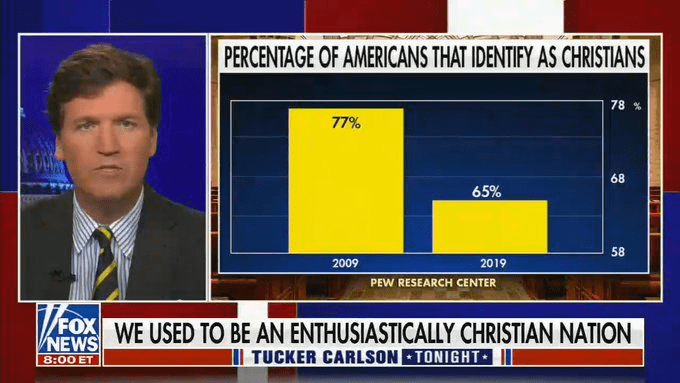
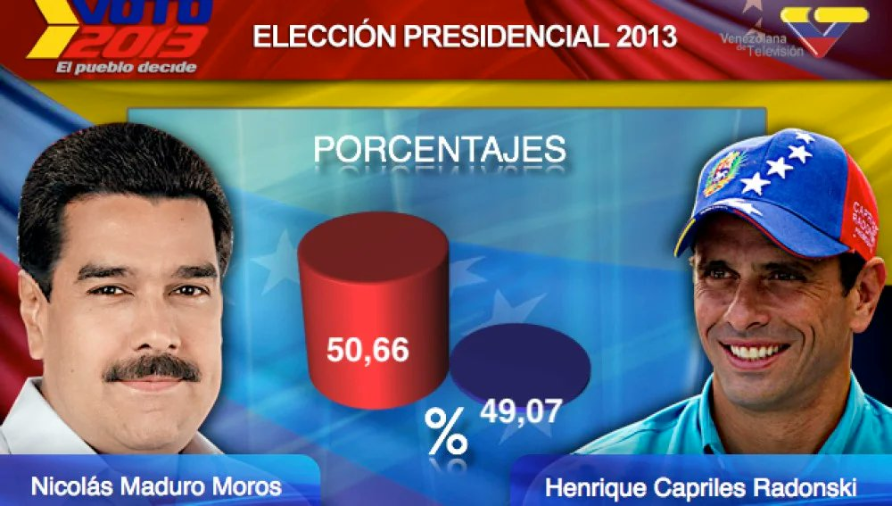
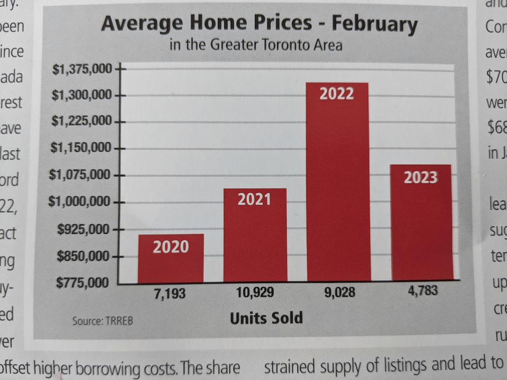

class: center, middle, inverse, title-slide

.title[
# Uncertainty, Publishing-Quality Figures, and Shiny
]
.subtitle[
## Communicating what you know and what you don't
]
.author[
### Jared Edgerton
]

---

# Quiz on canvas

- Log on to the course website to take it.
- You have 10 minutes.
- It is open notes and web.
- Do not generate your answers with AI.

---

# Quick Recap

- Last time, we focused on **geospatial data**:
  - choropleths and projections
  - counts vs rates
  - ecological fallacy

Today, we focus on three connected topics:

- **Uncertainty:** showing what you don't know
- **Publishing-quality figures:** checklists, export, accessibility
- **Shiny (brief intro):** making one figure interactive

---

# Setup

```{r, message=FALSE, warning=FALSE}
library(ggplot2)
library(dplyr)
library(tidyr)
library(scales)

set.seed(42)
```

---

# Why uncertainty matters

Every estimate has uncertainty:

- survey margins of error
- regression confidence intervals
- model predictions

If you don't show uncertainty, you are claiming **false precision**.

**Core rule:**
Show the reader how sure you are. If you can't quantify it, say so.

---

# Simulated data for today

We simulate survey data: estimated support for a policy across 8 countries, with different sample sizes (and therefore different standard errors).

```{r}
df <- data.frame(
  country = c("Aurelia", "Belvica", "Cordonia", "Deltara",
              "Eltonia", "Farland", "Galvinia", "Hestova"),
  estimate = c(62, 55, 48, 71, 44, 58, 52, 66),
  se = c(3.2, 4.1, 2.8, 5.5, 3.0, 6.2, 2.5, 4.8)
) %>%
  mutate(
    lower = estimate - 1.96 * se,
    upper = estimate + 1.96 * se,
    country = reorder(country, estimate)
  )
```

---

# Point estimates alone are misleading

```{r, fig.width=7, fig.height=4}
ggplot(df, aes(x = estimate, y = country)) +
  geom_point(size = 3) +
  theme_classic() +
  labs(x = "Support (%)", y = NULL,
       title = "Policy support by country (no uncertainty shown)")
```

This looks precise. But some estimates are much less certain than others.

---

# Adding error bars

```{r, fig.width=7, fig.height=4}
ggplot(df, aes(x = estimate, y = country)) +
  geom_errorbarh(aes(xmin = lower, xmax = upper), height = 0.25) +
  geom_point(size = 3) +
  theme_classic() +
  labs(x = "Support (%)", y = NULL,
       title = "Policy support with 95% confidence intervals")
```

Now you can see which differences are real and which overlap.

---

# Interpretation: overlapping intervals

Two intervals that overlap **does not** mean the difference is zero.

But it does mean:
- the difference is *uncertain*
- you should not claim a clear ranking

**Practical rule:**
If intervals overlap substantially, say "the estimates are not clearly different" rather than ranking them.

---

# Uncertainty with line charts (ribbons)

```{r, fig.width=7, fig.height=4}
set.seed(123)
ts <- data.frame(
  year = 2000:2024,
  estimate = cumsum(rnorm(25, 0.3, 1)) + 50
) %>%
  mutate(se = runif(25, 1.5, 4),
         lower = estimate - 1.96 * se,
         upper = estimate + 1.96 * se)

ggplot(ts, aes(x = year, y = estimate)) +
  geom_ribbon(aes(ymin = lower, ymax = upper), fill = "grey70", alpha = 0.4) +
  geom_line(linewidth = 0.7) +
  theme_classic() +
  labs(x = NULL, y = "Index",
       title = "Trend with uncertainty ribbon")
```

---

# Pause and discuss with a neighbor

Look at the ribbon plot.

**Prompt:**
- Where is the estimate most uncertain?
- Does the ribbon change whether you believe the trend is upward?
- What would happen if the ribbon crossed zero?

---

# Data visualization critique

- Take five minutes
  - What variables are mapped to what (x/y/color/size/etc.)?
  - Is it persuasive?
  - What design choices did they make?
  - After doing this talk to your neighbor briefly and compare notes.

.center[

]

---

# Frequency framing vs probability

Two ways to communicate uncertainty:

- **Probability:** "There is a 30% chance of rain"
- **Frequency:** "3 out of 10 days like this have rain"

Research shows frequency framing is easier for most readers to understand.

When possible, express uncertainty as frequencies:
- "In 20 surveys like this, about 19 would produce an estimate within this range"
- "If we repeated the experiment 100 times, about 95 results would fall in this band"

---

# "Don't go 3D" and other high-impact rules

Some design decisions almost always hurt clarity:

- **3D effects:** distort perception (especially 3D pie charts and bar charts)
- **Dual y-axes:** invite misinterpretation (different scales suggest false correlations)
- **Too many colors:** overwhelm the reader
- **Missing units:** "the index went up by 5" means nothing without context

---

# Publishing-quality figure checklist

Before you finalize a figure, check:

1. **Title:** descriptive, not generic ("GDP by country" not "Figure 1")
2. **Axis labels:** include units (%, dollars, per 100k)
3. **Caption/source:** where did the data come from?
4. **Legend:** positioned where it doesn't block data
5. **Color accessibility:** works in grayscale? colorblind-safe?
6. **Aspect ratio:** does the shape of the figure match the data?
7. **Text size:** readable at the intended display size
8. **Reproducibility:** can someone regenerate this from your code?

---

# Example: before the checklist

```{r, fig.width=7, fig.height=4}
ggplot(df, aes(x = estimate, y = country)) +
  geom_errorbarh(aes(xmin = lower, xmax = upper), height = 0.25) +
  geom_point(size = 3)
```

Problems: no title, no axis labels with units, default theme, no caption.

---

# Example: after the checklist

```{r, fig.width=7, fig.height=4}
ggplot(df, aes(x = estimate, y = country)) +
  geom_errorbarh(aes(xmin = lower, xmax = upper), height = 0.25, color = "grey40") +
  geom_point(size = 3, color = "steelblue") +
  geom_vline(xintercept = 50, linetype = "dashed", alpha = 0.5) +
  theme_classic(base_size = 13) +
  labs(
    x = "Support (%)",
    y = NULL,
    title = "Public support for climate policy",
    subtitle = "Point estimates with 95% confidence intervals",
    caption = "Source: Simulated survey data (n varies by country)"
  )
```

---

# Data visualization critique

- Take five minutes
  - What variables are mapped to what (x/y/color/size/etc.)?
  - Is it persuasive?
  - What design choices did they make?
  - After doing this talk to your neighbor briefly and compare notes.

.center[

]

---

# Data visualization critique

- Take five minutes
  - What variables are mapped to what (x/y/color/size/etc.)?
  - Is it persuasive?
  - What design choices did they make?
  - After doing this talk to your neighbor briefly and compare notes.

.center[

]

---

# Export settings matter

When saving figures for reports or presentations:

```r
ggsave("figure.png", plot = p,
       width = 7, height = 4,
       dpi = 300,          # high resolution
       units = "in")       # explicit units
```

Key settings:
- **dpi:** 300 for print, 150 for screen
- **width/height:** control aspect ratio explicitly
- **format:** PNG for raster, PDF for vector (scales cleanly)

---

# Color accessibility

About 8% of men have some form of color vision deficiency.

Design for accessibility:

- Use **viridis** or **ColorBrewer** palettes (designed to be distinguishable)
- Add **redundant encoding** (shape + color, or pattern + color)
- Test with a simulator (e.g., `colorBlindness` package or online tools)

---

# Brief intro to Shiny

Shiny lets you make a figure interactive with R code.

A minimal Shiny app has two parts:

- **UI (user interface):** what the user sees (inputs + plot area)
- **Server:** what R computes (reactive logic + plot code)

For the final project, you need a **basic** Shiny component: at minimum, one input (e.g., a dropdown) that changes one figure.

---

# Minimal Shiny structure

```r
library(shiny)
library(ggplot2)

ui <- fluidPage(
  titlePanel("My first Shiny app"),
  sidebarLayout(
    sidebarPanel(
      selectInput("country", "Choose a country:",
                  choices = c("Aurelia", "Belvica", "Cordonia"))
    ),
    mainPanel(
      plotOutput("myPlot")
    )
  )
)

server <- function(input, output) {
  output$myPlot <- renderPlot({
    # filter data based on input
    # create ggplot
  })
}

shinyApp(ui = ui, server = server)
```

---

# Key Shiny concepts

- **Reactive:** the plot updates when the input changes
- **`input$variable`:** reads what the user selected
- **`renderPlot({})`:** wraps your ggplot code
- **`plotOutput()`:** places the plot in the UI

You do **not** need to learn advanced Shiny. A dropdown + one updating plot is sufficient.

---

# What success looks like

- You show uncertainty (error bars, ribbons, or frequency framing) when estimates have it
- You recognize when overlapping intervals prevent strong claims
- You can apply the publishing-quality checklist to any figure
- You choose appropriate export settings (dpi, aspect ratio, format)
- You design for color accessibility
- You understand the basic structure of a Shiny app

---

# In-Class Activity

Find a visualization online.

With a neighbor:
- Identify the data variables
- Identify the visual mappings
- Decide what message the plot is making
- Suggest one concrete improvement

---

# What Comes Next

Next, we will practice in lab:

- adding confidence intervals and uncertainty ribbons to existing plots
- applying the publishing-quality checklist (redesign lab)
- peer critique workflow
- (optional) building a minimal Shiny app

Focus on clarity, not complexity.
